这是一个demo，说明如何利用pytorch搭建网络模型并训练、测试。
# 一、用到的数据集和文件说明
要用到的数据集和python文件放在demo目录下：https://github.com/matrix-dc/mlops-images/tree/main/pytorch/demo。
demo目录说明：
<pre>
demo
├── data   # 存放cifar10数据集，已下载并解压好。模型训练时用到此数据集。数据集下载地址：https://www.cs.toronto.edu/~kriz/cifar-10-python.tar.gz
│  └── cifar-10-batches-py
├── imgs   # 放置要推理的照片（飞机和小狗），模型测试要用到此照片。说明：在cifar10数据集中，飞机类别序号是0，小狗类型序号是5。
│   ├── airplane.png
│   └── dog.png
├── model.py # 网络模型model.py
├── test.py  # 模型测试test.py
└── train.py # 模型训练及验证train.py
</pre>

将data、imgs、model.py、test.py、train.py下载到本地，后续要上传到pytorch环境中使用。

# 二、前提
已注册并登录neolink.ai算力平台。
平台地址:
https://ai.neolink.com/
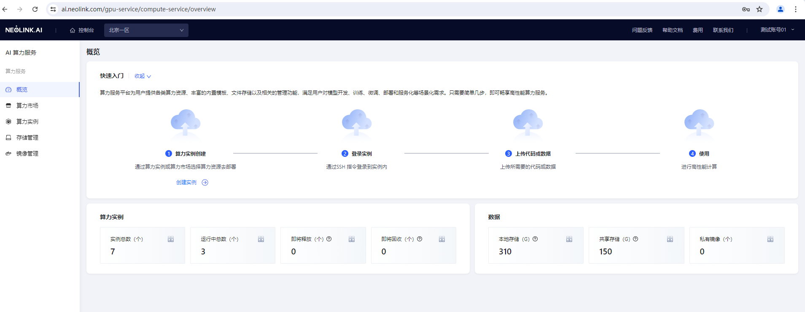

# 三、创建pytorch算力实例
在算力实例页面，创建实例，选择GPU算力规格，定义数据盘挂载路径/root/data，镜像选择pytorch。     
创建成功后，在算力实例页面可以看到该实例。
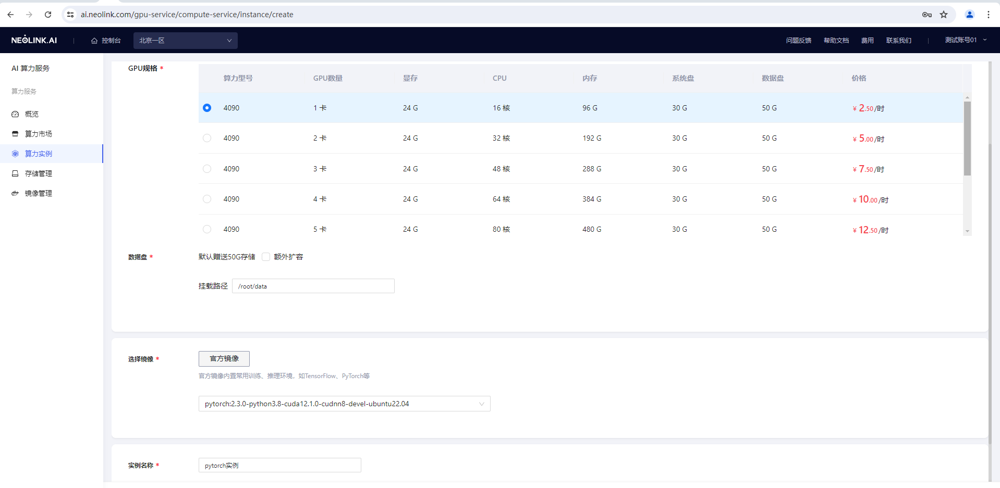
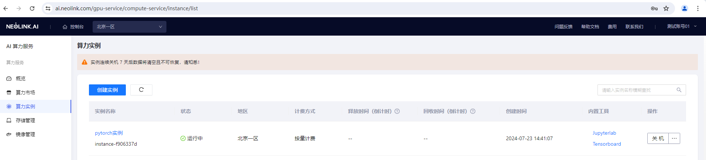

# 四、demo数据上传到实例
将data、imgs、model.py、test.py、train.py上传到/root/data/demo目录下。     

总共有3种方式将demo数据上传到实例：     
方法一、存储管理文件上传。     
方法二、jupyterlab窗口上传文件。     
方法三、SSH工具上传文件。     
## 4.1 方法一、存储管理文件上传
### 4.1.1 获取数盘信息
在实例列表，点击实例名称进入实例详情，在实例详情-存储页面，获取数据盘信息。
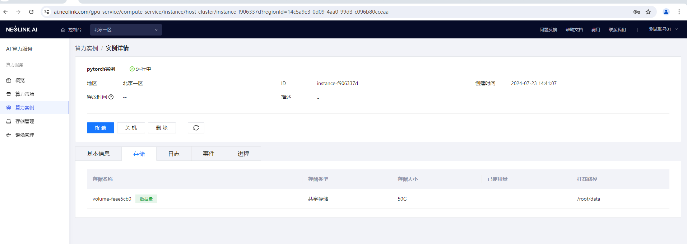
### 4.1.2 数据盘上传文件
在存储管理页面，找到对应数据盘，点击上传文件，将demo数上传
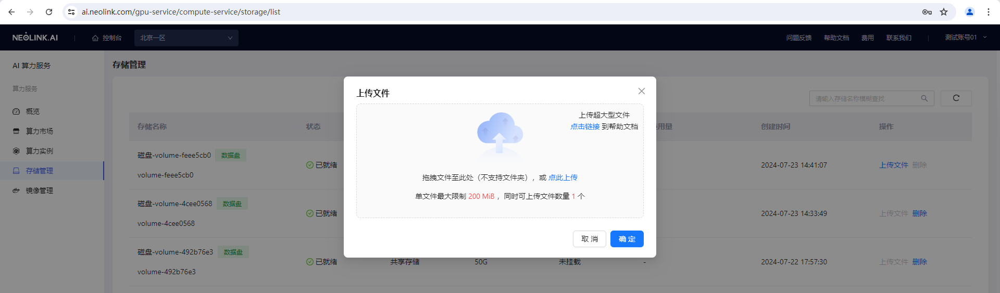

## 4.2 方法二、jupyterlab窗口上传文件
### 4.2.1 获取jupyterlab token
在实例列表，点击实例名称进入实例详情，在实例详情-日志页面，获取jupyterlab的token，此token在首次打开内置工具jupyterlab页面时要用到。
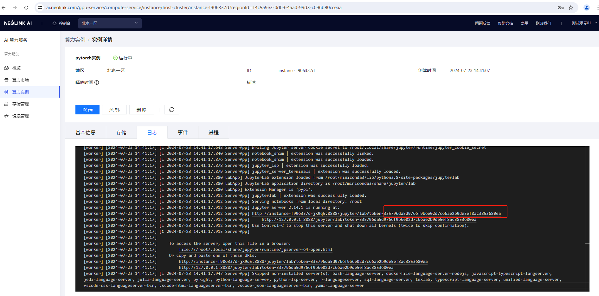
### 4.2.2 打开内置工具jupyterlab
在实例列表中，点击内置工具jupyterlab，将打开jupyterlab，首次打开，需要输入token登录，或者设置密码登录
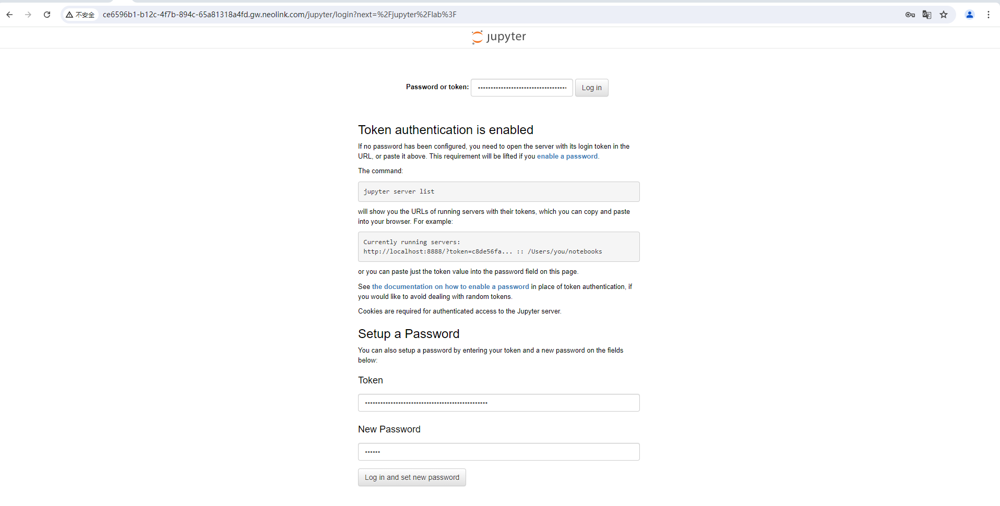
在jupyterlab左侧创建文件夹，并上传文件
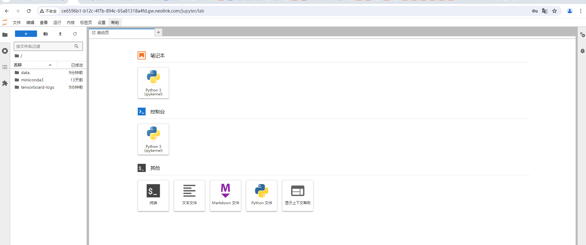

## 4.3 方法三、SSH工具上传文件
在实例列表操作栏，点击SSH连接，获取SSH登录信息。
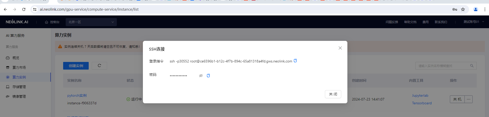
在本地SSH工具，进行SSH连接，连接后，上传文件
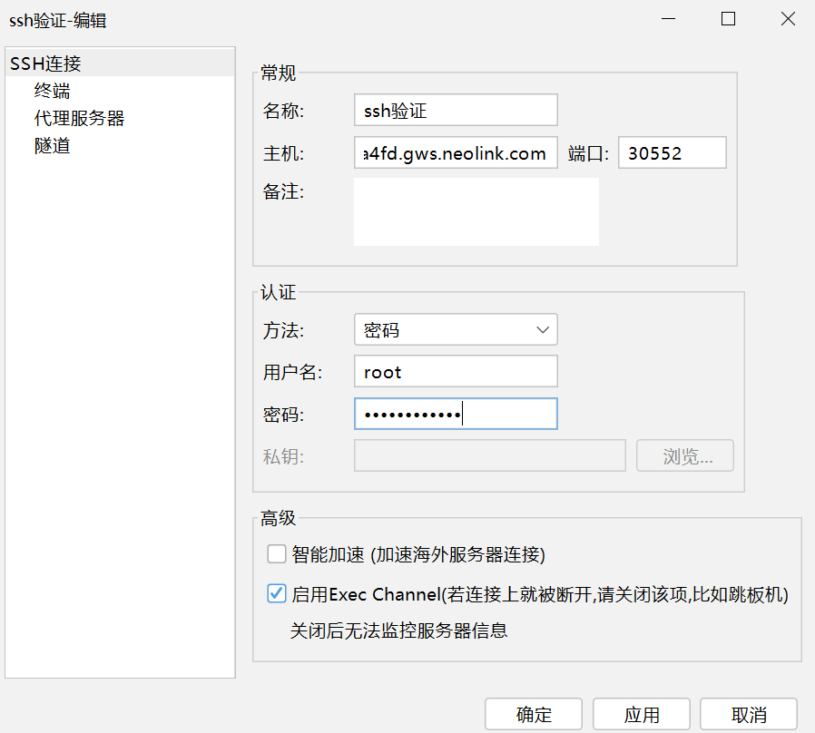
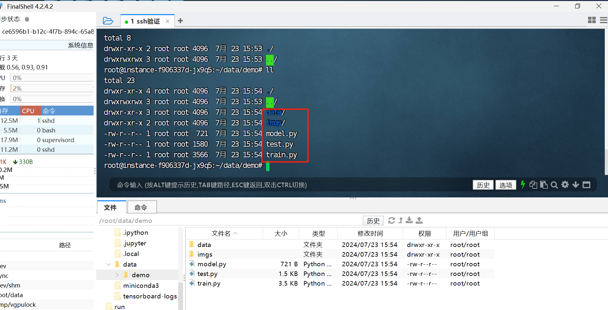
# 五、demo使用：搭建网络模型并训练、测试
登录终端，登录终端方式可以是jupyterlab的终端，也可以是SSH终端。
进入demo数据所在目录。这里演示在jupyterlab终端操作。
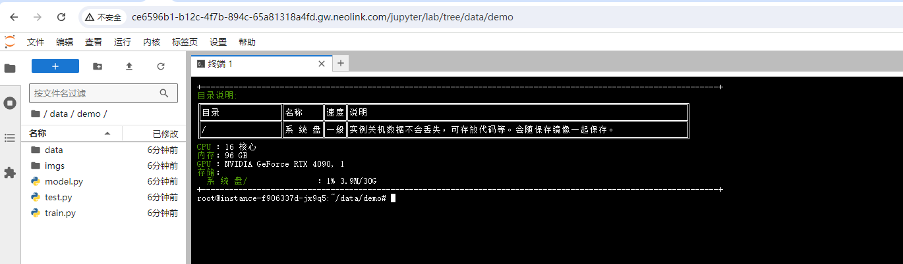
## 5.1 创建网络模型
python model.py
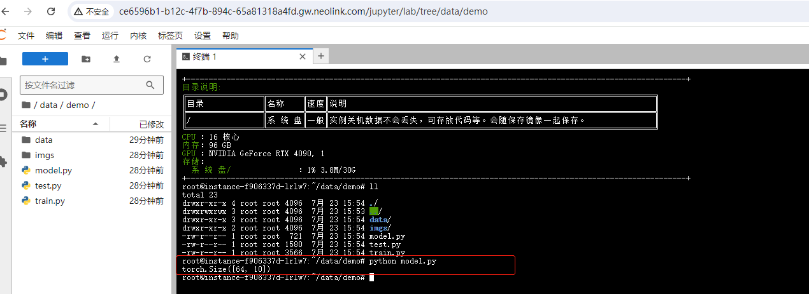
## 5.2 模型训练集验证
### 5.2.1 模型训练
python train.py
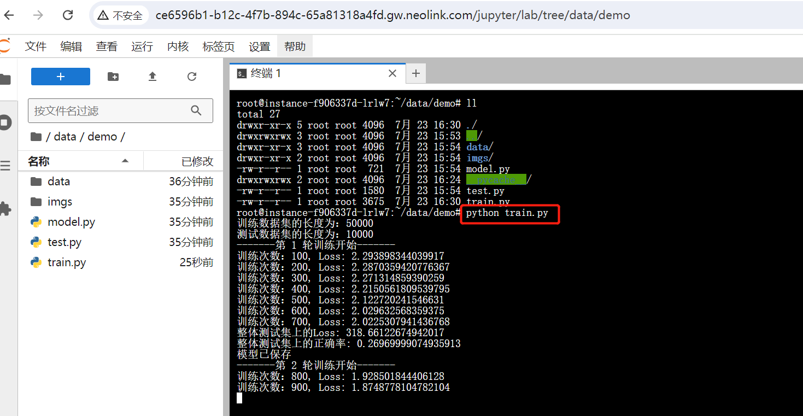
train.py指定总共训练10次，在当前目录下会生产对应的模型训练文件
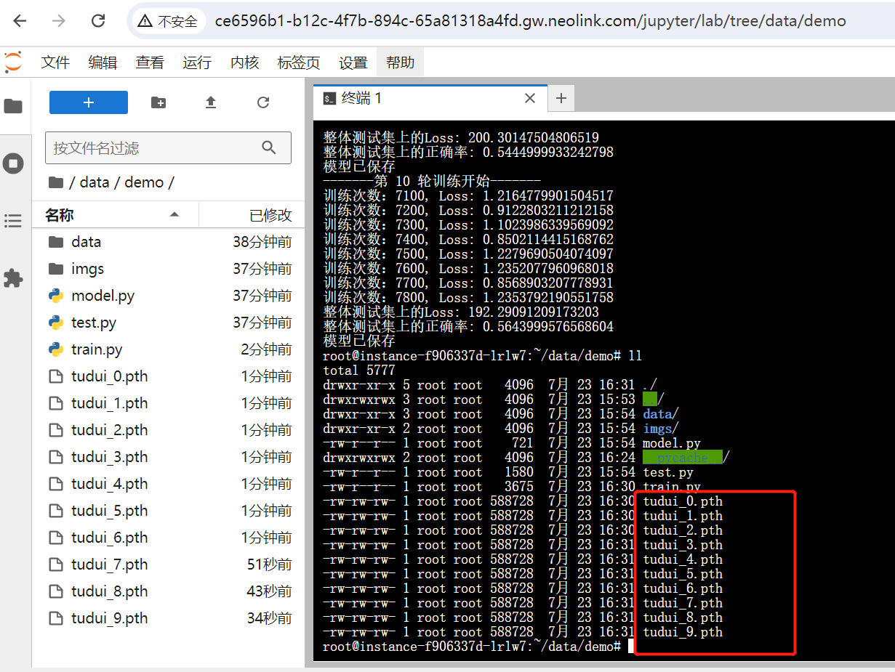
### 5.2.2 查看tensorboard得到的scalar图
查看方法：在实例列表，点击内置工具tensorboard，切换到scalars，查看可视化图
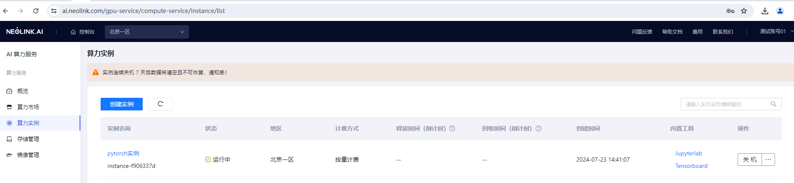
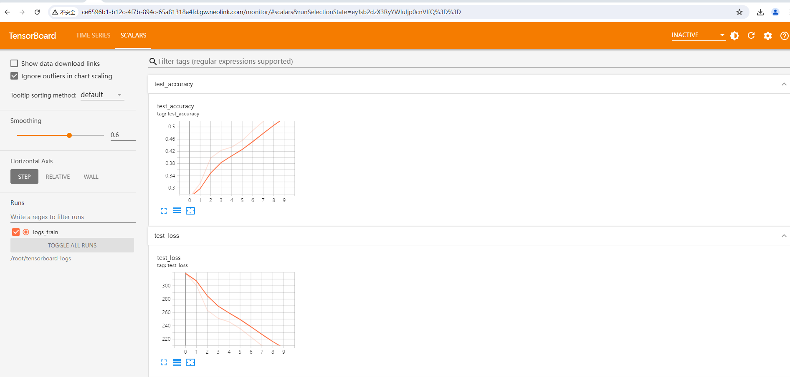
## 5.3 模型推理测试
python test.py
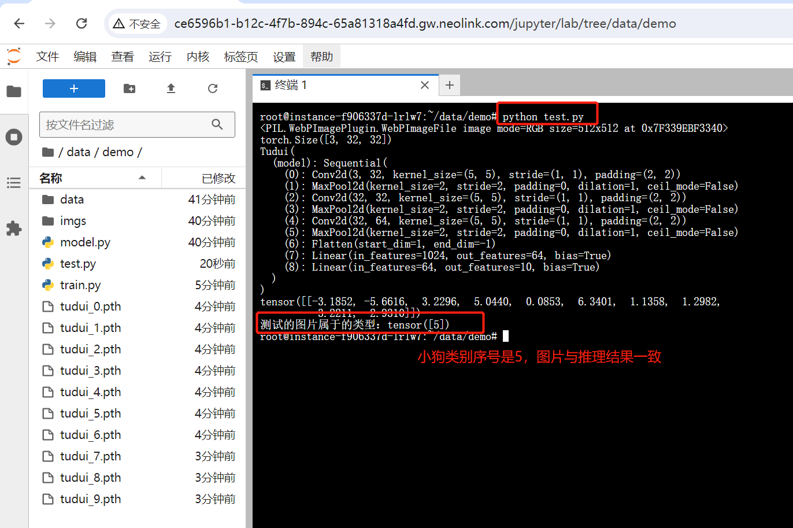