# 利用Neolink.AI平台，轻松训练 TensorFlow 模型

本文的核心在于构建一个 TensorFlow 的入门级 Demo，在Neolink.AI平台进行机器学习演示训练流程。

## 一、建立模型

假设如下为我们进行某项实验获得的一些实验数据：

| 输入 | 输出 |
| ---- | ---- |
| 1    | 4.8  |
| 2    | 8.5  |
| 3    | 10.4 |
| 6    | 21   |
| 8    | 25.3 |

我们将这些数据放到一个二维图上可以看的更直观一些，如下，这些数据在图中表现为一些离散的点：

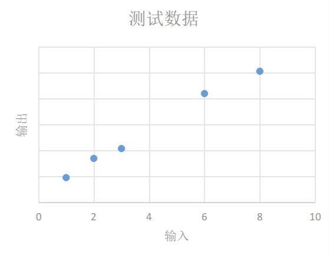

我们需要根据现有的这些数据归纳出一个通用模型，通过这个模型我们可以预测其他的输入值产生的输出值。

如下图，我们选择的模型既可以是红线表示的曲线模型，也可以是蓝线表示的线性模型，在概率统计理论的分析中，这两种模型符合真实模型的概率是一样的。

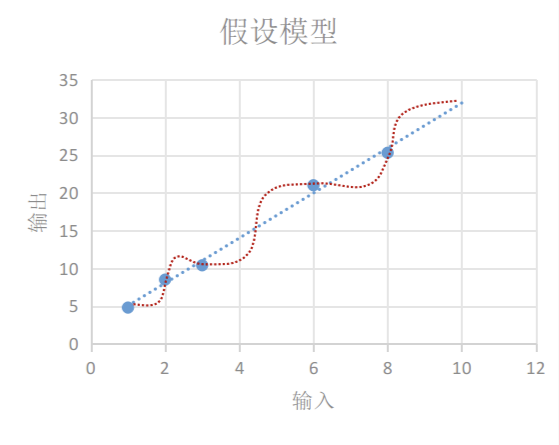

根据 “**奥卡姆剃刀原则-若有多个假设与观察一致，则选最简单的那个**，蓝线表示的线性模型更符合我们的直观预期。
如果用 x表示输入， y表示输出，线性模型可以用下面的方程表示：y=W×x+b

即使我们选择了直线模型，可以选择的模型也会有很多，如下图的三条直线都像是一种比较合理的模型，只是 W和b参数不同。这时我们需要设计一个损失模型(loss model)，来评估一下哪个模型更合理一些，并找到一个最准确的模型。

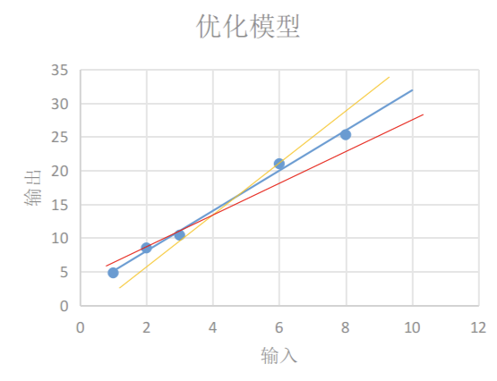

如下图每条黄线代表线性模型计算出来的值与实际输出值之间的差值:

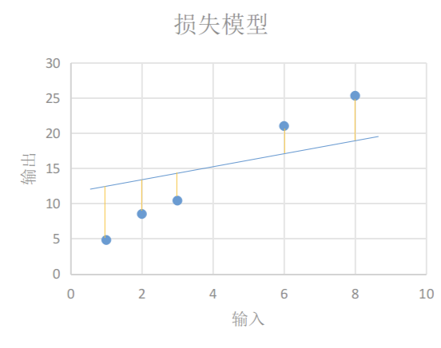

我们用y′表示实验得到的实际输出，用下面的方程表示我们的损失模型：loss=∑n=1N(yn−y′n)2

显然，损失模型里得到的loss越小，说明我们的线性模型越准确。

## 二、使用Tensorflow实现训练模型Demo

上面我们根据实验数据建立了一个线性模型，并为这个线性模型设计了一个损失模型，下面介绍的是怎么在 TensorFlow 中实现我们设计的模型。

在我们的线性模型 y=W×x+b 中，输入x可以用占位 Tensor 表示，输出y可以用线性模型的输出表示，我们需要不断的改变W和b的值，来找到一个使loss最小的值。这里W和b可以用变量 Tensor 表示。使用`tf.Variable()`可以创建一个变量 Tensor，完整的demo代码如下：

```python
import tensorflow as tf


# 创建变量
W = tf.Variable(0.0, name='W')
b = tf.Variable(0.0, name='b')

# 定义线性模型
@tf.function
def linear_model(x):
    return W * x + b

# 定义损失函数
@tf.function
def loss(y_true, y_pred):
    return tf.reduce_sum(tf.square(y_true - y_pred))

# 定义优化器
optimizer = tf.keras.optimizers.SGD(0.001)

# 创建数据
x_train = [1, 2, 3, 6, 8]
y_train = [4.8, 8.5, 10.4, 21.0, 25.3]

# 创建一个TensorBoard writer
logdir = "/root/tensorboard-logs"  # Neolink.AI平台Tensorflow镜像镜像默认指定的tensorboard-logs地址
writer = tf.summary.create_file_writer(logdir)

# 训练模型
for i in range(10000):
    with tf.GradientTape() as tape:
        y_pred = linear_model(x_train)
        curr_loss = loss(y_train, y_pred)
    gradients = tape.gradient(curr_loss, [W, b])
    optimizer.apply_gradients(zip(gradients, [W, b]))
    
    # 使用TensorBoard记录损失
    with writer.as_default():
        tf.summary.scalar("loss", curr_loss, step=i)

# 打印最终的参数值和损失
print("After train W: %s b %s loss: %s" % (W.numpy(), b.numpy(), curr_loss.numpy()))
```

## 三、在Neolink.AI平台进行模型训练

### 3.1 前提

- 用户已注册登录Neolink.AI平台（https://ai.neolink.com/）
- 已使用Tensorflow镜像创建一个gpu规格的实例，且实例状态为运行中（下面演示时选择规格是4090/24G 单卡）

### 3.2 上传Demo

方式一：通过存储管理页，选择实例挂载的存储进行上传，存储默认挂载目录为/root/data

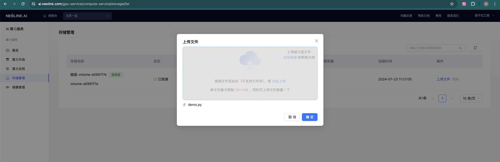

方式二：通过通过Jupyterlab页进行上传。点击内置工具Jupyterlab链接进入登录页，输入token（实例详情日志中查看）点击Log in进入Jupyterlab控制台页，工作目录为/root，点击左侧目录data文件夹，进入该文件夹后，点击上传图标进行上传demo.py

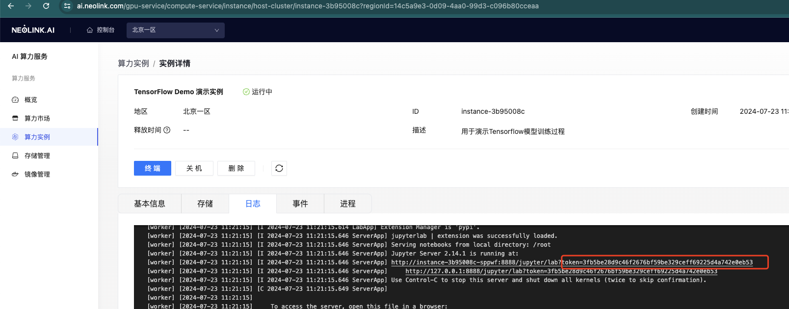

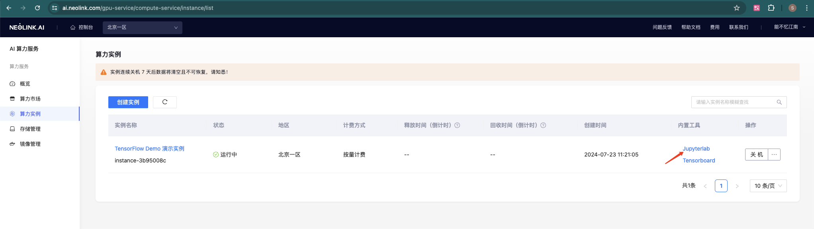

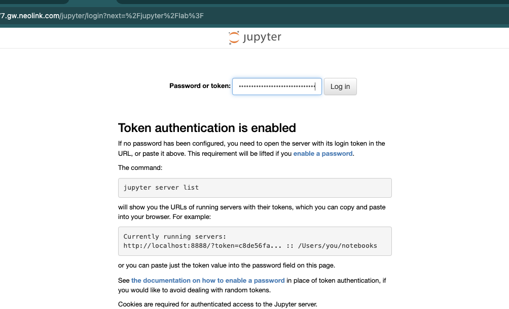 

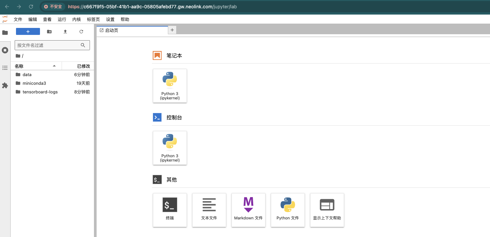

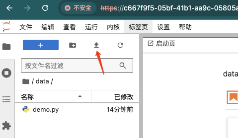

方式三：通过scp 命令上传

[NEOLINK.AI用户手册-数据传输]: https://ai.neolink.com/docs/DataStorage/data%20transmission

```shell
scp -rP 40567 demo.py user@111.51.90.14:/root/data
```

其中40567是实例端口号，111.51.90.14是实例ip，我们需要根据自己的实例进行修改。

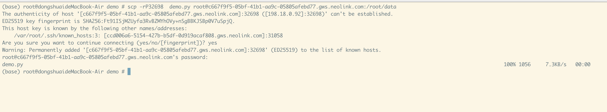

### 3.3 进行模型训练

在Jupyterlab中，点击终端进入终端页面

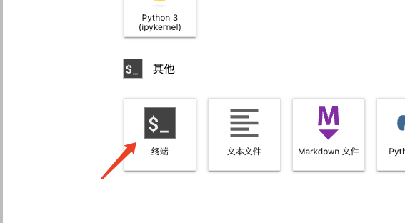

或者通过ssh登入容器

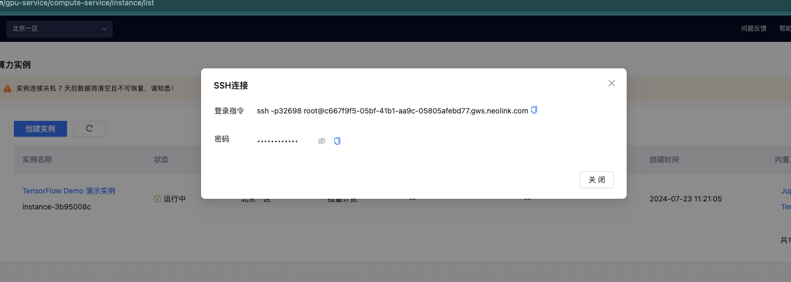

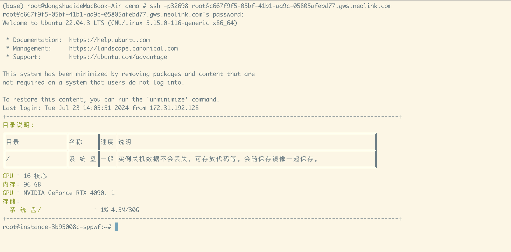

执行以下命令进行模型训练（下面为在Jupyterlab的终端页面执行演示）

```shell
cd /root/data
python demo.py
```

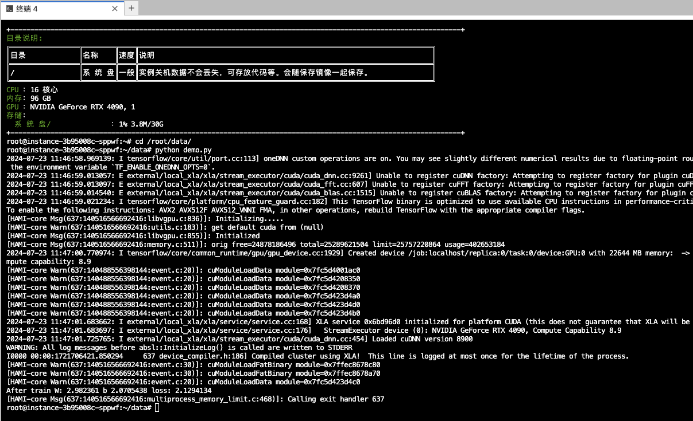

从运行中的日志可以看出，使用一个gpu：NVIDIA GeForce RTX 4090进行训练，并输出了训练结果：

```
After train W: 2.982361 b 2.0705438 loss: 2.1294134
```

### 3.4 使用TensorBoard查看训练数据

点击TensorBoard链接进入到页面，可以看到我们通过tf.summary.scalar("loss", curr_loss, step=i)设置的loss收敛曲线，从图中可以看出在训练了大概1000次的时候loss就已经收敛的差不多了。

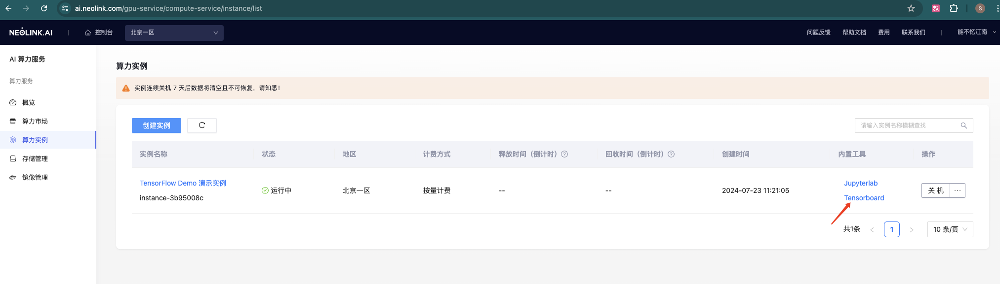

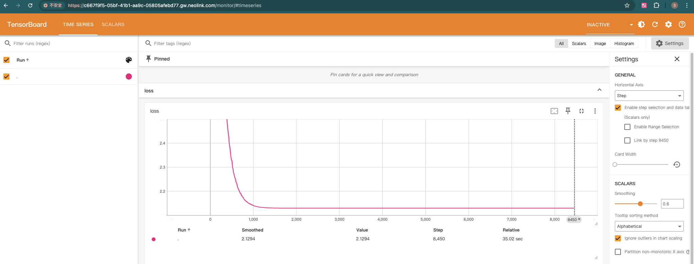